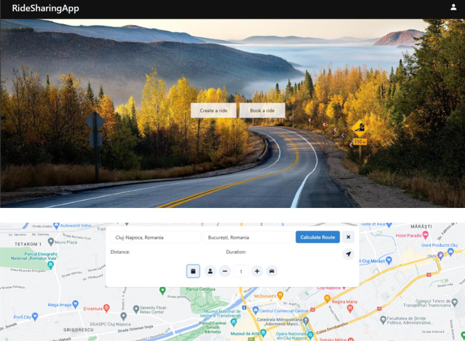

# Ride Sharing App

## Overview
Ride Sharing App is an innovative application developed to simplify and enhance the urban travel experience. Built on advanced technologies such as Spring Java for the backend and React for the frontend, this platform offers a comprehensive and efficient solution for ride-sharing and quick connections between drivers and passengers.

## Key Features
- **Secure Authentication System**: Ensures user security with a robust authentication system, including email validation for secure and authentic accounts.
- **Interactive Map**: Utilizes Google API to provide an interactive map that facilitates the search and display of available rides based on criteria like departure location, destination, and desired schedule.
- **Ride Creation and Booking**: Users can easily initiate or join existing rides, specifying details such as place of departure, destination, date, and time.
- **Account Customization**: Allows users to customize their account details, including personal information and ride preferences.

## Technologies Used
- **Backend (Spring Java)**: Manages user security, database interactions with MySQL, and data handling through Spring Data JPA.
- **Frontend (React)**: Develops a responsive and attractive interface, integrates Google API for the interactive map, and manages logic with JavaScript.
- **Email Validation (MailDev)**: Ensures account authenticity with email validation, efficiently managed with MailDev.

## Screenshots
  
*Interactive map powered by Google API.*
